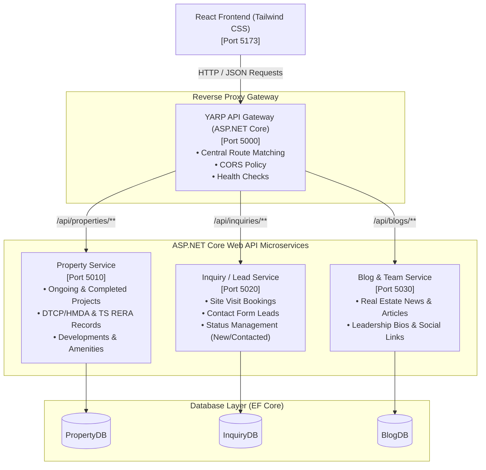

# Real Estate Microservices Platform (Ridge Homes Clone)
> Built for Full-Stack .NET Developer Internship at **Shiwansh Solution**

A production-grade clone of [Ridge Homes](https://ridgehomes.in/), designed with **ASP.NET Core 8 Microservices**, **YARP (Yet Another Reverse Proxy) API Gateway**, **Entity Framework Core**, and **React + Tailwind CSS**.

---

## 🏛️ System Architecture



---

## 🚀 Port & Routing Allocation

| Component | Technology | Local Port | Key Endpoints |
| :--- | :--- | :--- | :--- |
| **Frontend Client** | React + Tailwind CSS + Lucide | `5173` | `/`, `/projects`, `/projects/:slug`, `/about-us`, `/contactus`, `/blogs`, `/admin` |
| **API Gateway** | ASP.NET Core + YARP | `5000` | `/api/properties/**`, `/api/inquiries/**`, `/api/blogs/**` |
| **Property Service** | ASP.NET Core + EF Core | `5010` | `GET /api/properties/projects`, `GET /api/properties/projects/{slug}` |
| **Inquiry Service** | ASP.NET Core + EF Core | `5020` | `POST /api/inquiries/submit`, `GET /api/inquiries`, `PUT /api/inquiries/{id}/status` |
| **Blog Service** | ASP.NET Core + EF Core | `5030` | `GET /api/blogs`, `GET /api/blogs/team` |

---

## ⚡ Quick Start

### 1-Click Startup (Windows)
Double-click `run-all.bat` or run:
```cmd
run-all.bat
```
This automatically launches all 3 microservices, the YARP API Gateway, and the Vite React development server in separate windows.

### Manual Individual Commands

1. **Start Property Service (Port 5010):**
   ```bash
   cd src/Services/PropertyService
   dotnet run --urls http://localhost:5010
   ```

2. **Start Inquiry Service (Port 5020):**
   ```bash
   cd src/Services/InquiryService
   dotnet run --urls http://localhost:5020
   ```

3. **Start Blog Service (Port 5030):**
   ```bash
   cd src/Services/BlogService
   dotnet run --urls http://localhost:5030
   ```

4. **Start YARP Gateway (Port 5000):**
   ```bash
   cd src/ApiGateway/RealEstate.YarpGateway
   dotnet run --urls http://localhost:5000
   ```

5. **Start React Frontend (Port 5173):**
   ```bash
   cd src/ClientApp
   npm run dev
   ```

---

## 🏢 Exact Ridge Homes Features Cloned

1. **Header & Topbar:**
   - Hotline (`+91 9000888152`), email (`info@ridgehomes.in`), and **ISO 9001:2015 Certification badge**.
   - Dropdown menus with ongoing (**Kshetra**, **Tranquil Valley**) and delivered (**Sunrise City**, **Spring City**) ventures.
2. **Hero Section:**
   - Thematic branding: *"An Inspiration for Ridge. Inspiring Conscious Living in Hyderabad"*.
3. **Project Details Pages (e.g., `/projects/kshetra`):**
   - Official **RERA Number** (`P01100009098`) & **DTCP Approval** (`135/2024/H`).
   - Interactive **Developments photo carousel** (CC Roads, Paver footpaths, Harvesting pits, Mandua homes, Central park).
   - **Area Division Statistics** (150 Acres, 31 Acres Phase 1, 151 units, 3 Acres park).
   - **Location Highlights** with precise commute times (Sangareddy, Neopolis, Hitech City, Shamshabad Airport).
   - Embedded interactive Google Map and **Site Visit Booking Form**.
4. **About Us Page:**
   - Full philosophy on nature-centric conscious living.
   - **Meet Our Team** leadership section with expandable biographies for Srinivas Raju Vetukuri (Managing Partner), Kalyan Maddimsetti (AGM Sales), Hema Penmetsa (Operations), Siva Rama Raju (Legal), and Yamini (HR).
5. **Interactive Admin Portal (`/admin`):**
   - Live lead management dashboard showing all incoming inquiries, customer contact details, venture requested, and real-time status updating (*New* $\rightarrow$ *Contacted* $\rightarrow$ *Closed*).
